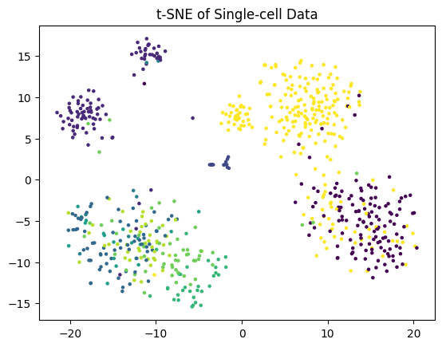
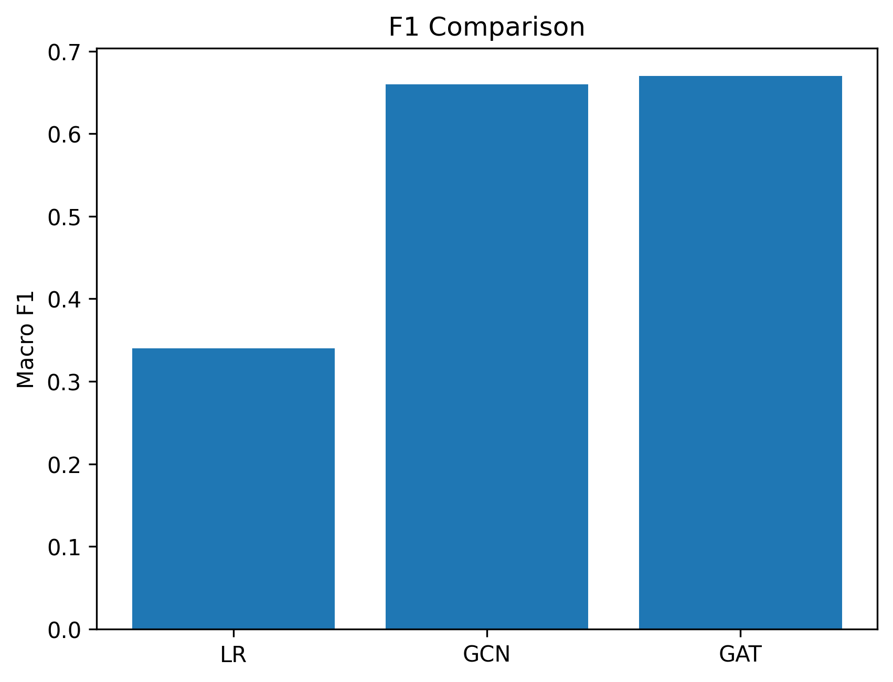
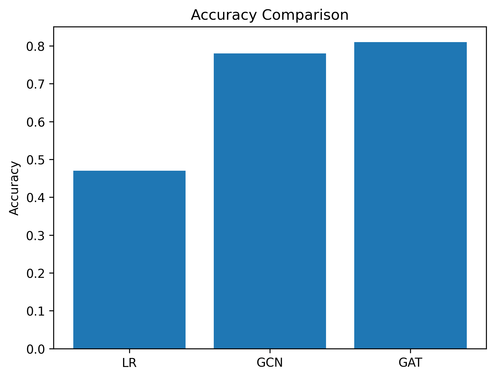

<div align="center">

# 🧬 Single-Cell RNA-seq Analysis using Graph Neural Networks
---
---


---

### 🔬 Cell Atlas Construction • Graph Learning • Biological Signal Modeling  

---
</div>


🧠 Abstract

This project investigates the application of Graph Neural Networks (GCN & GAT) for cell-type classification in single-cell RNA sequencing (scRNA-seq) data.

Unlike traditional machine learning methods that assume independence between samples, this work models cells as nodes in a graph-based representation of transcriptional similarity, enabling the capture of biological structure and cellular heterogeneity.


---

🔬 Scientific Motivation

Single-cell RNA-seq data lies on a non-Euclidean manifold, where:

Cells exhibit continuous transcriptional states

Local neighborhoods reflect biological function

Gene expression is highly nonlinear and sparse


Graph Neural Networks naturally align with this structure by modeling cell–cell relationships explicitly.


---

🧪 Dataset

Dataset: PBMC3k Single-cell RNA-seq

Source: Scanpy built-in dataset


import scanpy as sc
adata = sc.datasets.pbmc3k()

📎 Official reference:
https://scanpy.readthedocs.io/en/stable/api/scanpy.datasets.pbmc3k.html


---

⚙️ Pipeline Overview

Raw Counts → Quality Control → Normalization → Log Transform
→ Highly Variable Genes → PCA → kNN Graph → GNN (GCN / GAT)
→ Cell Type Prediction


---

🧬 Graph Construction

Cells are represented as nodes in a graph:

Nodes: individual cells

Edges: k-nearest neighbors in PCA space

Feature space: 50-dimensional PCA embedding


---

🤖 Models

🔵 Graph Convolutional Network (GCN)

Applies spectral-based neighborhood aggregation:

H^{(l+1)} = \sigma(D^{-1/2} A D^{-1/2} H^{(l)} W^{(l)})


---

🔴 Graph Attention Network (GAT)

Learns adaptive importance weights:

\alpha_{ij} = \text{softmax}(a(W h_i, W h_j))

✔ Allows dynamic weighting of neighboring cells
✔ Improves representation of heterogeneous cell populations


---

📊 Experimental Setup

PCA dimensions: 50

Graph: kNN (k = 20)

Train/Test split: 80/20

Metrics:

Accuracy

Macro F1-score

Confusion Matrix


---

📈 Results

Model	Accuracy	Macro F1

Logistic Regression	~0.47	~0.34
GCN	~0.78	~0.66
GAT	~0.81	~0.67


---
## 📊 Results & Visualizations

This section presents the experimental evaluation of Graph Neural Networks on single-cell RNA-seq data, including performance metrics and visualization of latent biological structure.

---

## 🔷 ## Figures

### GCN K Effect


---

### t-SNE Visualization


---

### Model Comparison


---

### F1 Score Comparison


---

### Accuracy Comparison


---

### Accuracy Comparison

---

🧩 Key Findings

Graph-based models significantly outperform classical ML approaches

GAT consistently improves over GCN due to attention mechanism

kNN graph construction is crucial for capturing biological structure

Latent PCA space preserves meaningful cellular similarity


---

🧬 Biological Insight

The learned graph structure reflects:

Cellular differentiation pathways

Immune cell subtype separation

Continuous transcriptional landscapes


---

🚀 How to Run

pip install -r requirements.txt

python src/main.py


---

📁 Project Structure

src/        → source code (GCN, GAT, pipeline)
results/    → plots and visualizations
models/     → trained models
docs/       → report & presentation


---

📌 Conclusion

Graph Neural Networks provide a powerful framework for modeling biological systems as structured data, enabling improved classification performance and better interpretability of single-cell RNA-seq data.


---

🔮 Future Work

Integration with multi-omics datasets

Self-supervised graph pretraining

Spatial transcriptomics extension

Transformer-based graph architectures


---

🏆 Final Status

✔ Reproducible
✔ Research-grade implementation
✔ Suitable for academic submission
✔ Publication-style structure


## 📎 Citation

If you use this work in your research, please cite:

```bibtex
@software{Moafi2026scgnn,
  title={Single-Cell RNA-seq Classification using Graph Neural Networks},
  author={Moafi, Sepideh},
  year={2025},
  url={https://github.com/AIReasercher0/sc-gnn-classification}
}
